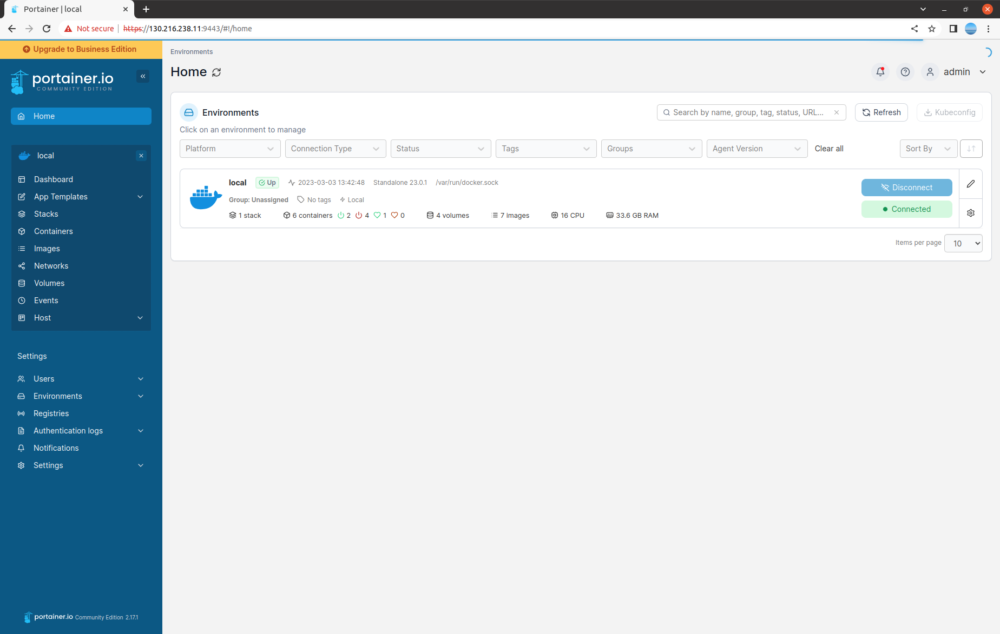
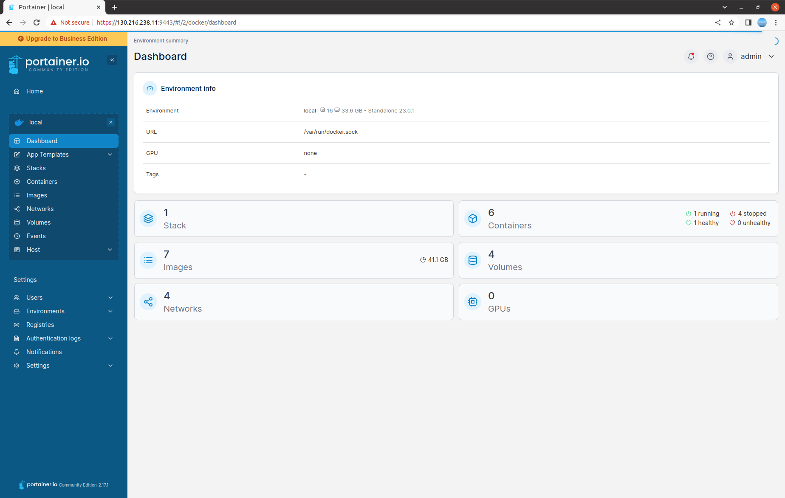
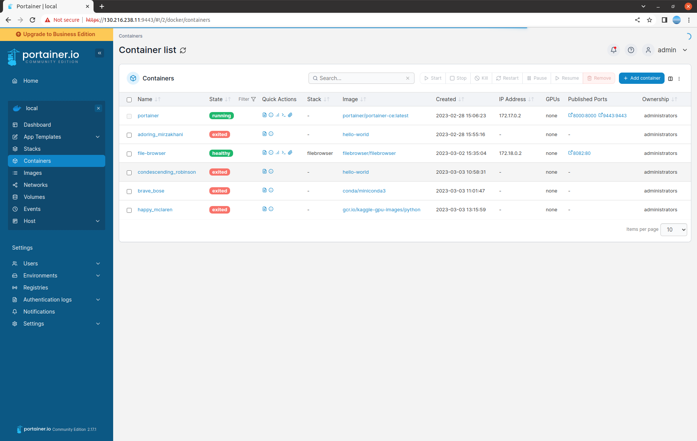
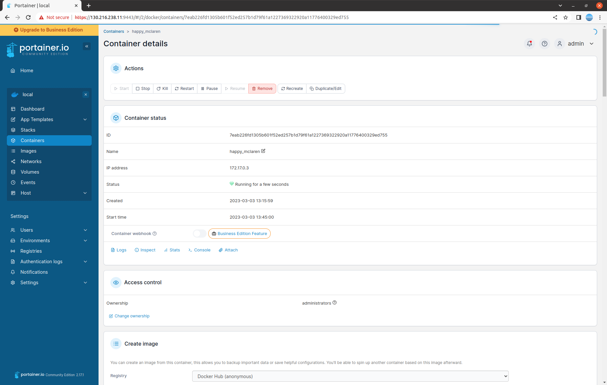
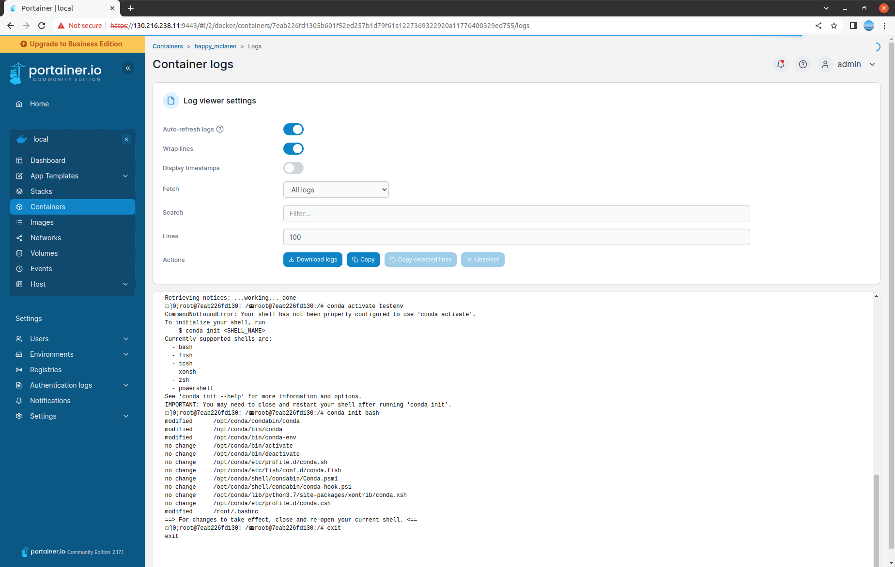
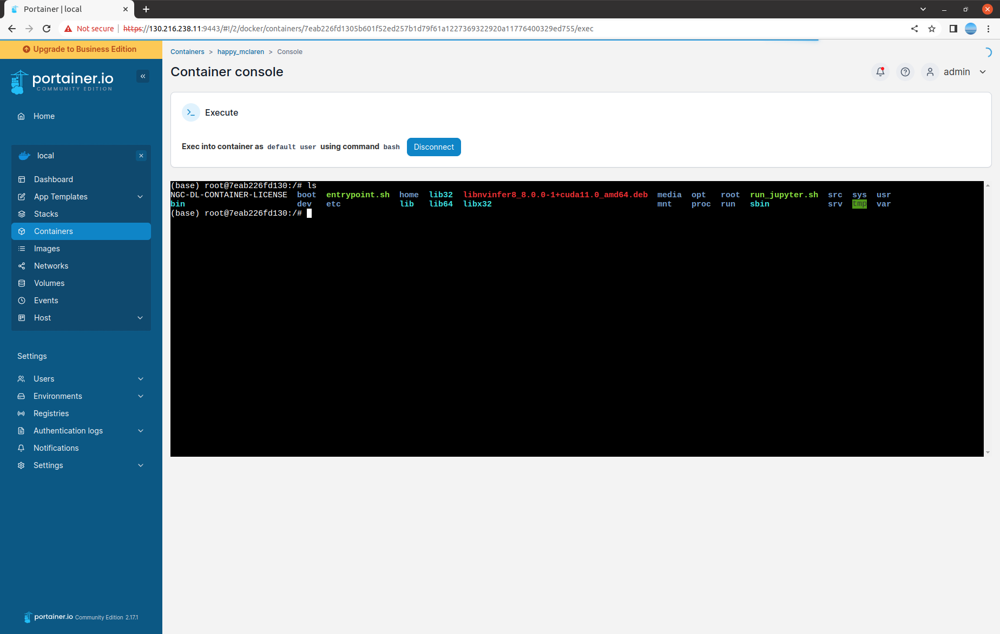

# Install Ubuntu 22.04
- install ubuntu 22.04 destop  (https://releases.ubuntu.com/22.04/)
- Click 'Show Application' > 'Additional Drivers' and choose 'Using NVIDIA driver metapackage from nvidia-driver-510(proprietary)', then reboot the system. 


# Add a user
You can add a user(myuser1/pass1) as follows. You can change id(myuser1) and password(pass1) as you want. 
```
sudo adduser myuser1 --gecos "myuser1,RoomNumber,WorkPhone,HomePhone" --disabled-password
echo "myuser1:pass1" | sudo chpasswd
```

# Install openssh-server
```
sudo apt update
sudo apt install openssh-server
```
Now, you can connect the system using ssh. 
```
ssh username@ipaddress
```

# Install Nvidia Docker
- Install Docker CE (https://docs.docker.com/engine/install/ubuntu/)
- Install Nvidia Docker (https://docs.nvidia.com/datacenter/cloud-native/container-toolkit/install-guide.html#docker)
- Install Docker Compose
```
sudo apt install docker-compose
```
- Add the user into the docker group
```
sudo usermod -aG docker myuser1
```

Now, you can try the following command. 
```
docker run --rm --runtime=nvidia --gpus all nvidia/cuda:11.6.2-base-ubuntu20.04 nvidia-smi
```
You shuold see the output of nvidia-smi. 

# Set docker default runtime as nvidia
Use docker run with nvidia as the default runtime
You can set nvidia as the default runtime, for example, by adding the following line to the /etc/docker/daemon.json configuration file as the first entry.
```
"default-runtime": "nvidia",
```
The following is an example of how the added line appears in the JSON file. Do not remove any pre-existing content when making this change.
```
{
 "default-runtime": "nvidia",
  "runtimes": {
     "nvidia": {
         "path": "/usr/bin/nvidia-container-runtime",
         "runtimeArgs": []
     }
 },
}
```
Reboot the system and try the following command. 
```
docker run --rm --gpus all nvidia/cuda:11.6.2-base-ubuntu20.04 nvidia-smi
```
You shuold see the output of nvidia-smi. 

# Install Portrainer 
We use Portrainer to manage docker containers. Run the Portainer as a docker and visit https://localhost:9443 to set the admin account. 
```
docker run -d -p 8000:8000 -p 9443:9443 --name portainer --restart=always -v /var/run/docker.sock:/var/run/docker.sock -v portainer_data:/data portainer/portainer-ce:latest
```

We can easily monitor and manage all the containers, images, networks and volumes on the web. 
Home:

Dashboard:

Containers:

Container details:

Container logs:

Container console:



# Build a custom docker image

# Default Docker volume for the persistant data 
[Youtube tutorial](https://www.youtube.com/watch?v=OrQLrqQm4M0)

First,we need to connect to the machine with myuser1 account.
```
ssh myuser1@localhost
```

We create a volume mapped to /home/myuser1/data path. This volume will be mounted in a container. So you can share data between containers. 
```
mkdir /home/myuser1/data
docker volume create --name datastore --opt type=none --opt device=/home/myuser1/data --opt o=bind
```

# (Optional) Install FileBrowser for a user
Install [FileBrowser](https://filebrowser.org/installation) to transfer files if you want to use web-based file browser instead termimal. 


First,we need to connect to the machine with myuser1 account.
```
ssh myuser1@localhost
```

Create folder and files to use FileBrowser as a docker container. 
```
mkdir filebrowser
cd filebrowser/
touch docker-compose.yml
touch filebrowser.db
```

Check your uid/gid. We'll use uid/gid for docker-compose.yml.
```
id
```

We need to edit docker-compose.yml. 
```
nano docker-compose.yml 
```

Use your uid:gid instead '1001:1001'. And use your userid instead 'myuser1'. 
```
version: '3'
services:
  file-browser:
    image: filebrowser/filebrowser
    container_name: file-browser
    user: 1001:1001
    ports:
      - 8082:80
    volumes:
      - /home/myuser1/:/srv
      - /home/myuser1/filebrowser/filebrowser.db:/database.db
    restart: unless-stopped
    security_opt:
      - no-new-privileges:true
```
And run the docker-compose. 
```
docker-compose up -d
```
Visit http://ipaddress:8082 to access FileBrowser. Default id/password is admin/admin


