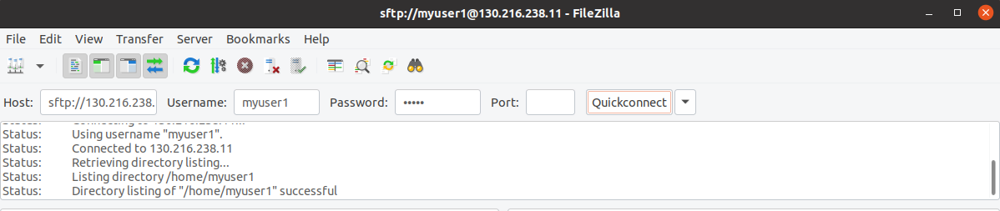
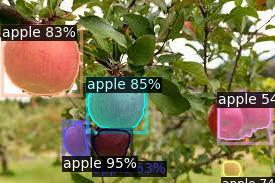

(For the administrator instruction, please visit [here](ADMINISTRATOR.md).)

# Instructions to use Workstations
**(Important) Before [making any bookings](https://docs.google.com/spreadsheets/d/1zhHadk0wmTiC-7sPKSpjd_AZx0OvK8aj4Ujtha3rbNA/edit?usp=sharing), please contact your supervisor for approval.** If you require space in the lab, you have the option to [book a hot desk](https://docs.google.com/spreadsheets/d/16roMJnZQagsN7I5vJj-z6_1oq_aH4012/edit?usp=sharing&ouid=113035994987226744270&rtpof=true&sd=true).

## List of GPU Workstations
The robotics lab houses these workstations. If you have access to the lab, you can utilize these machines on-site.

| Name                | IP              | OS           | GPU Driver  | CUDA | GPU          | GPU Mem  |
| ------------------  | --------------- | ------------ | ----------- | ---- | ------------ | -------- |
| P6000-1 (UOA370131) | 130.216.238.11  | Ubuntu 22.04 | 510.108.03  | 11.6 | Quadro P6000 | 24576MiB |
| P6000-2 (UOA370132) | 130.216.238.146 | Ubuntu 22.04 | 510.108.03  | 11.6 | Quadro P6000 | 24576MiB |
| P6000-3 (UOA370133) | 130.216.238.16  | Ubuntu 22.04 | 510.108.03  | 11.6 | Quadro P6000 | 24576MiB |
| P6000-4 (UOA370142) | 130.216.238.182 | Ubuntu 22.04 | 510.108.03  | 11.6 | Quadro P6000 | 24576MiB |

--- 

## Connect to the Workstation Remotely using SSH
To connect to the workstations remotely, you will need to use an SSH client, such as Terminal on Linux/MacOS or Command Prompt on Windows, on your local machine. Your local machine must be connected to the UoA network via Wi-Fi or Ethernet cable. If you are off-campus, you will need to connect to the UoA's VPN. If your Windows OS does not have OpenSSH installed, you can find instructions on how to add it [here](https://ittutorials.net/microsoft/windows-10/enable-ssh-windows-10-command-prompt/). Alternatively, you can use other ssh clients, such as [PuttySSH](https://www.putty.org/).

To obtain an account for the workstations, please reach out to your supervisor. Once you have an [active booking](https://docs.google.com/spreadsheets/d/1zhHadk0wmTiC-7sPKSpjd_AZx0OvK8aj4Ujtha3rbNA/edit?usp=sharing) for the workstation, open your terminal and enter the following command.
```bash
# You should execute the following command on your local machine.
ssh username@IP-address-of-workstation
```

### Connect ssh without password
To connect to SSH without a password, you will need to set up SSH key authentication between the client machine (where you are connecting from) and the server machine (where you are connecting to). Here are the general steps to follow:

1. Generate an SSH key pair on the client machine. This can be done using the following command:
```bash
# You should execute the following command on your local machine.
ssh-keygen
```
This will generate a public key file (usually named id_rsa.pub) and a private key file (usually named id_rsa) in the ~/.ssh/ directory.

2. Copy the public key to the server machine. You can do this using the ssh-copy-id command, which will copy the public key to the server's authorized keys file:
```bash
# You should execute the following command on your local machine.
ssh-copy-id username@IP-address-of-workstation
```

This will prompt you for the server password, and then add your public key to the server's ~/.ssh/authorized_keys file.
3. Test the connection. You should now be able to connect to the server without a password by running:
```bash
# You should execute the following command on your local machine.
ssh username@IP-address-of-workstation
```
This should log you into the server without prompting for a password.

---

## Transfer Data between Local machine and Workstations

### Using [FileZila Client](https://filezilla-project.org/):

- Download and install FileZilla on your local machine from the official website.
- Open FileZilla and click on the "Site Manager" button.
- In the Site Manager, click on the "New Site" button and enter the following details:
  - Host: IP address or hostname of the remote machine
  - Protocol: SFTP (SSH File Transfer Protocol)
  - Logon Type: Normal
  - User: Your username on the remote machine
  - Password: Your password on the remote machine

- Click on the "Connect" button to connect to the remote machine.
- Once connected, you will see two panels in FileZilla. The left panel shows the files on your local machine, while the right panel shows the files on the remote machine.
- To transfer files, simply drag and drop them from one panel to the other.
- You can monitor the progress of file transfers in the "Queued files" tab.

That's it! You can use FileZilla to transfer files between your local machine and the remote machine easily and securely.

### Using [SCP](https://manpages.ubuntu.com/manpages/trusty/man1/scp.1.html)
- Open your terminal or command prompt.
- Type the following command to transfer a file from your local machine to the remote machine:

```bash
# You should execute the following command on your local machine.
scp /path/to/local/file username@remote:/path/to/remote/directory
```

Replace /path/to/local/file with the path to the local file you want to transfer, username with your username on the remote machine, remote with the IP address or hostname of the remote machine, and /path/to/remote/directory with the path to the remote directory where you want to transfer the file.

- Enter your password when prompted, and the file will be transferred.

That's it! You can use similar commands to transfer files from the remote machine to your local machine or to transfer directories and their contents.

--- 

## Enable GPU resource utilization for your container

To incorporate GPU resources within the container, include the following options: 
```
--privileged --runtime==nvidia -v /dev/shm:/dev/shm -e NVIDIA_VISIBLE_DEVICES=all -e NVIDIA_DRIVER_COMPABILITIES=all
```

For instance, you can start a container by following the command below.
```bash
# You should execute the following command on the workstation.
docker run --rm -it --privileged --runtime=nvidia \
-v /dev/shm:/dev/shm \
-e NVIDIA_VISIBLE_DEVICES=all \
-e NVIDIA_DRIVER_COMPABILITIES=all \
nvidia/cuda:11.6.2-devel-ubuntu20.04 \
/bin/bash
```

To confirm whether your container has access to the GPU resources on the host machine, you can execute the command below:

```bash
# You should execute the following command within the container.
nvidia-smi
```

The expected output/messages should be as follows.

```
+-----------------------------------------------------------------------------+
| NVIDIA-SMI 510.108.03   Driver Version: 510.108.03   CUDA Version: 11.6     |
|-------------------------------+----------------------+----------------------+
| GPU  Name        Persistence-M| Bus-Id        Disp.A | Volatile Uncorr. ECC |
| Fan  Temp  Perf  Pwr:Usage/Cap|         Memory-Usage | GPU-Util  Compute M. |
|                               |                      |               MIG M. |
|===============================+======================+======================|
|   0  Quadro P6000        Off  | 00000000:03:00.0 Off |                  Off |
| 26%   28C    P8     9W / 250W |    200MiB / 24576MiB |      0%      Default |
|                               |                      |                  N/A |
+-------------------------------+----------------------+----------------------+
```


---

## How to share data between the workstation and containers

The **'/home/$USER/data'** directory on the workstation is intended for sharing data between the workstation and containers. This directory is already mapped to a Docker volume, allowing the data to be accessed from Docker containers. You can use this directory to share training dataset between the workstation and containers. To use this volume, add the following options when starting a container:
```
--mount source=datastore,target=/data
```

To upload your training dataset to the workstation, use FileZilla or scp to transfer the files to the '/home/$USER/data' directory. Once the data is uploaded, you can access it from the '/data' directory within the container.

For instance, you can start a container by following the command below.
```bash
# You should execute the following command on the workstation.
docker run --rm -it --runtime=nvidia -v /dev/shm:/dev/shm --mount source=datastore,target=/data nvidia/cuda:11.6.2-devel-ubuntu20.04 /bin/bash
```

Upload any data to the '/home/$USER/data' directory, and you should be able to see those files in the '/data' folder within the container.

```bash
# You should execute the following command within the container.
ls /data
```

---

## Docker commands 
Please visit [the official docs](https://docs.docker.com/engine/reference/run/) to see all the docker commands and their options. 

### List containers
To list the running containers, simply execute the docker ps command, 
```bash
# You should execute the following command on the workstation.
docker ps
```
To include all the containers present on your Docker host, append the -a option, 
```bash
# You should execute the following command on the workstation.
docker ps -a
```

### Start/Stop/Kill containers

To stop one or more running Docker containers, you can use the docker stop command
```bash
# You should execute the following command on the workstation.
docker stop container-name
```

To start containers, 
```bash
# You should execute the following command on the workstation.
docker start container-name
```

And you can kill containers. 
```bash
# You should execute the following command on the workstation.
docker kill container-name
```

### Run containers

Use run command to have a container. 

```bash
# You should execute the following command on the workstation.
docker run hello-world
```

Add **--privileged --runtime==nvidia -v /dev/shm:/dev/shm -e NVIDIA_VISIBLE_DEVICES=all -e NVIDIA_DRIVER_COMPABILITIES=all** options to have gpu resource in the container. For more options, please refer to [here](https://docs.nvidia.com/datacenter/cloud-native/container-toolkit/user-guide.html).

```bash
# You should execute the following command on the workstation.
docker run --privileged --runtime=nvidia \
-v /dev/shm:/dev/shm \
-e NVIDIA_VISIBLE_DEVICES=all \
-e NVIDIA_DRIVER_COMPABILITIES=all \
nvidia/cuda:11.6.2-devel-ubuntu20.04 \
nvidia-smi
```

You can exit the session of the container. 

```bash
# You should execute the following command within the container.
exit
```

If you want to re-connect to the container, start the container(if it's not running) and execute an interactive shell.

```bash
# You should execute the following command on the workstation.
docker exec -it container-name /bin/bash
```

Visit [the docker image recommendation page](RECOMMENDATIONS.md) to find images used in the lab. 

---
## **(Strongly Recommend) Setup a remote development environment**

### **Visual Studio Code**
With [Visual Studio Code](https://code.visualstudio.com/), you can develop code inside a remote container just as easily as on your local machine, and also transfer files back and forth. Follow the instructions in [this guide](VSCODE.md) to get started using Visual Studio Code for remote container development.

---

## CARES Dockers

https://hub.docker.com/repositories/mycares

Docker images supporting the Nvidia CUDA toolkit have been created for internal purposes.


### Pytorch 1.13 (Cuda 11.6)

The image was built based on the [Nvidia image]((https://hub.docker.com/r/nvidia/cuda/tags?page=1&name=11.6.2-devel-ubuntu20.04)) and installed PyTorch 1.13 + CUDA 11.6 in a Conda environment. To use it, you will need to first pull it from Docker Hub.

```bash
# You should execute the following command on the workstation.
docker pull mycares/pytorch:1.13.0-cuda11.6-ubuntu20.04
```

Next, start a container by running the following command.

```bash
# You should execute the following command on the workstation.
docker run -it --runtime=nvidia -v /dev/shm:/dev/shm --mount source=datastore,target=/data mycares/detectron2:2023.03.21 /bin/bash
```

After connecting to the container, activate the Conda environment for PyTorch.

```bash
# You should execute the following command within the container.
conda activate torch1.13.0
```

It is recommended to use pip to install Python packages. For example:
```bash
# You should execute the following command within the container.
pip install tqdm
```


### Detectron2 (Cuda 11.6)
The image was built based on the [Nvidia image]((https://hub.docker.com/r/nvidia/cuda/tags?page=1&name=11.6.2-devel-ubuntu20.04)) and installed PyTorch 1.13 + CUDA 11.6 + Detectron2(2023.03.21) in a Conda environment. To use it, you will need to first pull it from Docker Hub.

```bash
# You should execute the following command on the workstation.
docker pull mycares/detectron2:2023.03.21
```

Next, start a container by running the following command.

```bash
# You should execute the following command on the workstation.
docker run -it --runtime=nvidia -v /dev/shm:/dev/shm --mount source=datastore,target=/data mycares/detectron2:2023.03.21 /bin/bash
```

Once connected to the container, activate the conda environment for detectron2. 

```bash
# You should execute the following command within the container.
conda activate torch1.13.0
```

You can try a quick demo of Detectron2 by copying any image file (and naming it 'input.jpg') into the '/home/$USER/data' directory of the workstation using FileZilla Client, and then listing the file in your container. In this example, we will use the following image.


List the file in your container. 
```bash
# You should execute the following command within the container.
ls /data
```

In order to perform a quick demo, navigate to the '~/workspace/detectron2/demo' directory after verifying that the input.jpg file has been successfully transferred to your container.

```bash
# You should execute the following command within the container.
cd ~/workspace/detectron2/demo
```

Create a folder named 'output' to save the output files from the demo.

```bash
# You should execute the following command within the container.
mkdir ~/workspace/detectron2/demo/output 
```

Now, we are ready to run the demo script. 

```bash
# You should execute the following command within the container.
python demo.py --config-file ../configs/COCO-InstanceSegmentation/mask_rcnn_R_50_FPN_3x.yaml \
  --input /data/input.jpg \
  --output output \
  --opts MODEL.WEIGHTS detectron2://COCO-InstanceSegmentation/mask_rcnn_R_50_FPN_3x/137849600/model_final_f10217.pkl
```

Copy the output folder into /data in your container to see the result.

```bash
# You should execute the following command within the container.
cp -r output/ /data/
```

Once you have refreshed FileZilla Client, go to the shared directory (/home/$USER/data) on the workstation. Inside, you'll find a directory named 'output' that contains the resulting file.



Please utilize pip within this conda environment if you require additional Python packages.
```bash
# You should execute the following command within the container.
pip install tqdm
```

### Need your own container?
**WIP**
Search and use docker images you want [here](https://hub.docker.com/). 

For the cuda supports, check [nvidia/cuda](https://hub.docker.com/r/nvidia/cuda) dockerhub for more tags. 

---


## How to create a persistent volume
[Youtube tutorial](https://www.youtube.com/watch?v=OrQLrqQm4M0)

By creating a Docker volume for persistent data, it is possible to share data between the workstation and containers.

In the following example, we create a volume mapped to /home/$USER/mydata path. This volume will be mounted in a container. So you can share data between containers. 
```bash
# You should execute the following command on the workstation.
mkdir /home/$USER/mydata
docker volume create --name mydatastore --opt type=none --opt device=/home/$USER/mydata --opt o=bind
```

To mount the volume to your container,
```bash
# You should execute the following command on the workstation.
docker run -it --runtime=nvidia -v /dev/shm:/dev/shm --mount source=mydatastore,target=/mydata nvidia/cuda:11.6.2-devel-ubuntu20.04 /bin/bash
```

The volume(mydatastore) is mounded on /mydata in the container. 
```bash
# You should execute the following command within the container.
ls /mydata
```

# FAQ
### 'nvidia-smi' gives 'Failed to initialize NVML: Unknown Error'

Simply, restart your container. 

```bash
# You should execute the following command on the workstation.
docker restart container-name
docker exec -it container-name /bin/bash
```
And try 'nvidia-smi' within your container.  
```bash
# You should execute the following command within the container.
nvidia-smi
```


---

