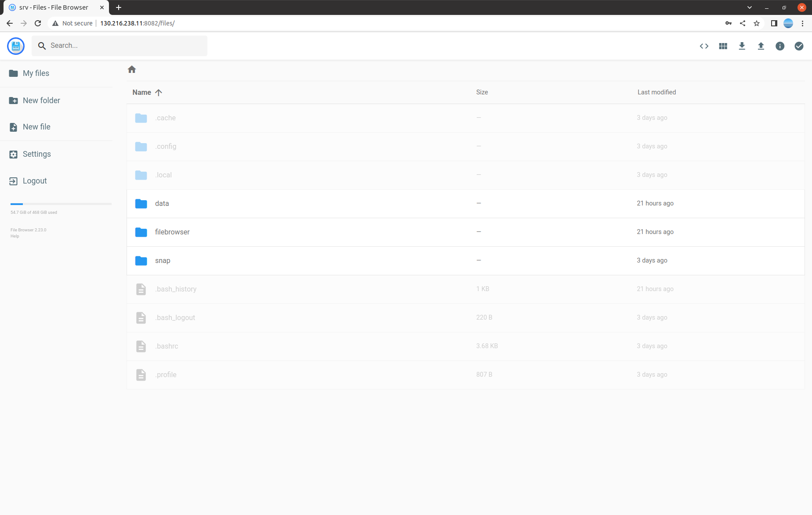

(For the administrator instruction, please visit [here](ADMINISTRATOR.md).)

# Instruction to use Workstations
(Important) Contact your supervisor first to [make bookings](https://docs.google.com/spreadsheets/d/1zhHadk0wmTiC-7sPKSpjd_AZx0OvK8aj4Ujtha3rbNA/edit?usp=sharing)

## List of GPU Workstations
| Name                | IP              | OS           | GPU Driver  | CUDA | GPU          | GPU Mem  |
| ------------------  | --------------- | ------------ | ----------- | ---- | ------------ | -------- |
| P6000-1 (UOA370131) | 130.216.238.11  | Ubuntu 22.04 | 510.108.03  | 11.6 | Quadro P6000 | 24576MiB |
| P6000-2 (UOA370132) | 130.216.238.xx  | Ubuntu 22.04 | 510.108.03  | 11.6 | Quadro P6000 | 24576MiB |
| P6000-3 (UOA370133) | 130.216.238.xx  | Ubuntu 22.04 | 510.108.03  | 11.6 | Quadro P6000 | 24576MiB |
| P6000-4 (UOA370142) | 130.216.238.182 | Ubuntu 22.04 | 510.108.03  | 11.6 | Quadro P6000 | 24576MiB |

--- 

## Connect to the Workstation Remotely using SSH
You can use an SSH client such as Terminal (in macOS) or Command
Prompt (in Windows), on your local machine. Your local machine must be connected to the UoA network (either via Wi-Fi or Ethernet cable). You need to connect to the UoA’s VPN if you are off-campus. If Open SSH is not installed in your Windows OS, you need to add it as explained [here](https://ittutorials.net/microsoft/windows-10/enable-ssh-windows-10-command-prompt/). Alternatively, you can use other ssh clients, such as [PuttySSH](https://www.putty.org/).

Currently we're using a shared account(myuser1/pass1). Open your terminal and type the following command. We assume you have an active booking for the workstation. ([Booking spreadsheet](https://docs.google.com/spreadsheets/d/1zhHadk0wmTiC-7sPKSpjd_AZx0OvK8aj4Ujtha3rbNA/edit?usp=sharing))
```
ssh myuser1@130.216.238.11
```

---

## Transfer Data to Workstations
There are multiple ways to transfer your data between your local machine and the workstations. A simple way is via an FTP Client such as [FileZila Client](https://filezilla-project.org/):


Or a web-based filebrowser can be used. Visit http://ipaddress:8082 to access FileBrowser. Default id/password is admin/admin.


Upload your training data into /home/$USER/data which is already mapped to docker volume, so it can be mounted to docker containers. Try the following command, and upload files into /home/$USER/data using FileZila or FileBrowser. You should see those files /data of the container. 

```
docker run --rm -it -runtime=nvidia --mount source=datastore,target=/data nvidia/cuda:11.6.2-base-ubuntu20.04 /bin/bash
```

---

## Use docker for training your model
Search dockers you want [here](https://hub.docker.com/).

For the quick review, 
```
docker run hello-world
```
Check [nvidia/cuda](https://hub.docker.com/r/nvidia/cuda) dockerhub for more tags. 
```
docker run --runtime=nvidia nvidia/cuda:11.6.2-base-ubuntu20.04 nvidia-smi
```

To list the running containers, simply execute the docker ps command, 
```
docker ps
```
To include all the containers present on your Docker host, append the -a option, 
```
docker ps -a
```
To stop one or more running Docker containers, you can use the docker stop command
```
docker stop container-name
```
To start containers, 
```
docker start container-name
```
And you can kill containers. 
```
docker kill container-name
```
To run an interactive shell in a container
```
docker exec -it container-name sh
```

(WIP) Add more practical examples !

Visit [the official docs](https://docs.docker.com/engine/reference/run/) to see all the docker commands and their options. 

Visit [the docker image recommendation page](RECOMMENDATIONS.md) to find images used in the lab. 

---

## Share data between containers 
[Youtube tutorial](https://www.youtube.com/watch?v=OrQLrqQm4M0)

In the following example, we create a volume mapped to /home/$USER/mydata path. This volume will be mounted in a container. So you can share data between containers. 
```
docker volume create --name mydatastore --opt type=none --opt device=/home/$USER/mydata --opt o=bind
```
To mount the volume to your container,
```
docker run --rm -it --runtime=nvidia --mount source=mydatastore,target=/mydata nvidia/cuda:11.6.2-base-ubuntu20.04 /bin/bash
```
The volume(mydatastore) is mounded on /data in the container

---

