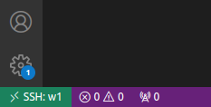
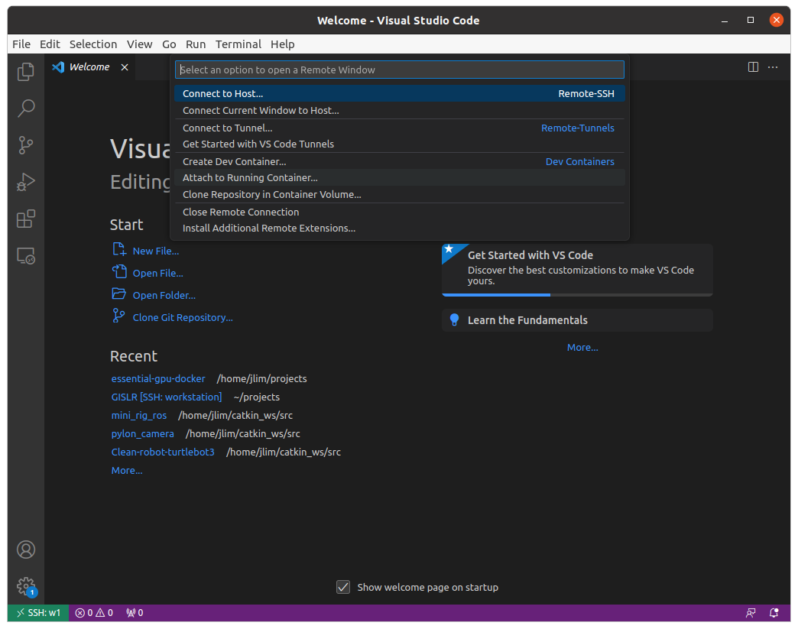
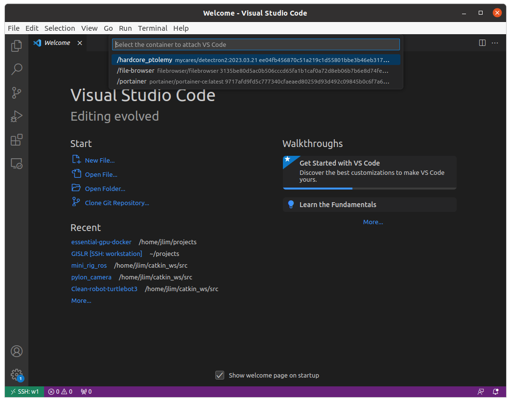

## Install VS Code

1. Download the installation package for your operating system from the official VS Code website: https://code.visualstudio.com/download

2. Once the package is downloaded, run the installation file and follow the prompts. The installation process may vary depending on your operating system.

3. If you are on a Windows machine, you may be prompted to select additional tasks such as adding VS Code to your PATH environment variable, creating a desktop shortcut, etc. You can choose the options that are most relevant to your workflow.

4. Once the installation is complete, open VS Code by double-clicking on the application icon. You should see the welcome screen with various options to start a new project or open an existing one.

5. You can now start using VS Code for your coding and development needs. To enhance the functionality of VS Code, you can install various extensions from the Visual Studio Marketplace.

## Install Remote Development extention for VS Code

1. Open VS Code on your computer.

2. Click on the Extensions icon on the left-hand side of the window. It looks like a square with four squares inside.

3. In the Extensions Marketplace search bar, type "Remote Development" and hit Enter.

4. The search results will include various extensions related to remote development. Look for the one that says "Remote Development" with the subtitle "Visual Studio Code extension for remote development in SSH, Containers, and WSL."

5. Click on the "Install" button next to the extension name.

6. Wait for the extension to download and install. This may take a few moments, depending on your internet connection.

7. Once the installation is complete, you may be prompted to restart VS Code. If so, click the "Restart" button to complete the installation.

8. To use the Remote Development extension, click on the "Remote Explorer" icon on the left-hand side of the VS Code window. This will show a list of available remote connection types, such as SSH, Containers, and WSL.

9. Select the type of connection you want to use and follow the prompts to set up the connection. Depending on the type of connection, you may need to provide login credentials, IP addresses, or other information to establish the connection.

10. Once the connection is established, you can use VS Code as normal, with the added functionality of being able to work remotely on other machines or environments.

### Connect to a remote SSH Server using VS Code

1. Open VS Code on your local machine.

2. Click on the "Remote Explorer" icon on the left-hand side of the VS Code window. This will show a list of available remote connection types.

3. Click on the "SSH Targets" section at the top of the Remote Explorer panel.

4. Click on the "Add SSH Host" button, which looks like a plus sign in a circle.

5. Enter the hostname or IP address of the remote server you want to connect to, along with your username and any other required login information.

6. Optionally, you can specify additional SSH options such as a non-default port number or a custom private key file.

7. Click the "Connect" button to establish the SSH connection. You may be prompted to enter your password or passphrase if necessary.

8. Once the connection is established, VS Code will create a new window that is connected to the remote server. You can now use VS Code to edit files, run commands, and perform other tasks on the remote server, just as if you were working locally.

### Connect to a docker container in a remote SSH Server

1. Open VS Code on your local machine.

2. Establish an SSH connection to the remote server running Docker containers, following the instructions in the previous answer.

3. Click the green button located at left-bottom of the vscode to open a remote window.

4. Click on the "Attach to Running Container" button, which looks like a green arrow pointing to a box. This will open a list of all running containers on the remote server.

5. Select the container you want to connect to from the list.

6. Once the connection is established, you can start developing code inside the container just as you would on your local machine.

## Install Python extension for the remote container 

To set up a Python development environment for remote container in VS Code, you'll need to install the Python extension for VS Code. Follow these steps:

1. Open VS Code and click on the Extension icon on the left sidebar.

2. In the search bar, type "Python" and press Enter.

3. The first search result should be "Python" by Microsoft. Click on the "Install in Container" button next to it.

4. Wait for the installation to finish, and then restart VS Code.

5. Once VS Code has restarted, you should now have access to the Python extension. You can verify this by going to the Extensions sidebar again and checking that the Python extension is installed and enabled.